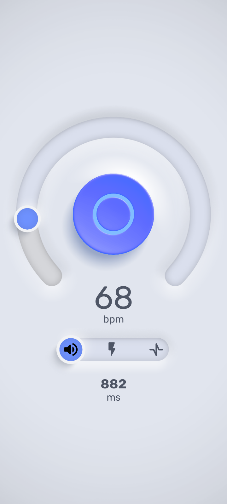
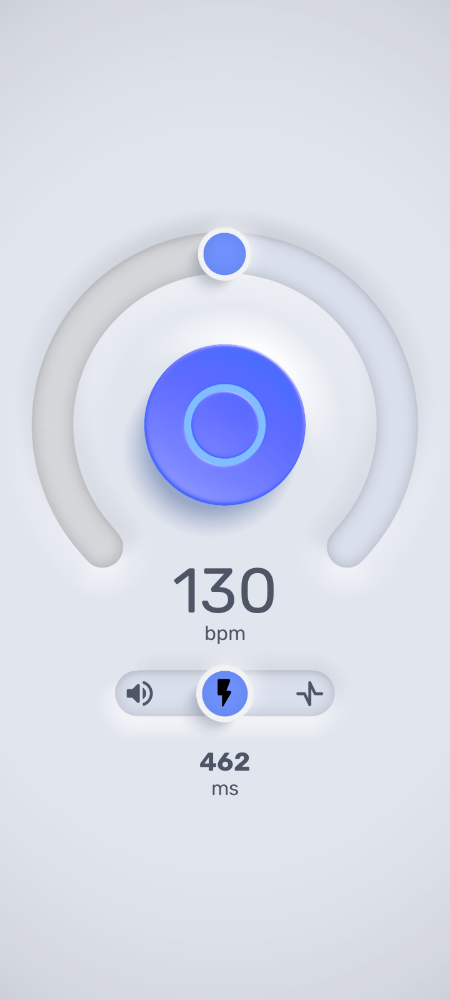
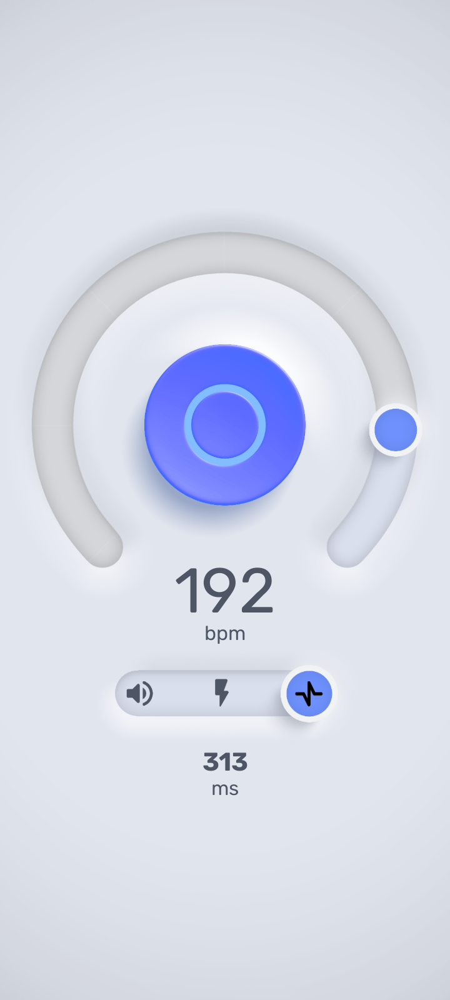

# Android Metronome App

Modernized Android metronome application built with MVVM architecture, reusable UI components, and responsive XML layouts.

[Figma Prototype](https://www.figma.com/design/vw6yaP2oIvpPNoT3QTRETy/Layout?node-id=356-186&t=LjbdhCSG2DGroDXo-1)

## Screenshots

| Splash | Sound | Flash | Pulse |
|:---:|:---:|:---:|:---:|
|  |  |  |  |

## Features

- MVVM architecture
- Fragment-based navigation
- Hilt dependency injection
- Low latency audio playback
- Camera flash synchronization
- Vibration feedback
- Responsive XML layouts
- Reusable custom views
- Custom typography system
- Figma-to-Android XML workflow
- Modular architecture

## Tech Stack

| Category | Technologies |
|---|---|
| **Language** | Java |
| **Platform** | Android SDK |
| **Architecture** | MVVM |
| **DI** | Hilt |
| **State** | LiveData |
| **UI** | Fragments, ConstraintLayout, Custom Views, Material Components, XML Layouts |
| **Jetpack** | Android Jetpack |

## Architecture

The application follows MVVM architecture with clear separation between UI, business logic, hardware interaction, and background services.

```
┌─────────────────────────────────┐
│           UI Layer              │  Fragments + Custom Views
├─────────────────────────────────┤
│          ViewModels             │  State + Business Logic
├─────────────────────────────────┤
│      Managers / Engines         │  Audio, Flash, Vibration
├─────────────────────────────────┤
│     Hardware Controllers        │  SoundManager, FlashController
├─────────────────────────────────┤
│          Services               │  MetronomeService (background)
└─────────────────────────────────┘
```


## Contact

**Oleksandr C.**

[LinkedIn](https://www.linkedin.com/in/ochashchin/)

